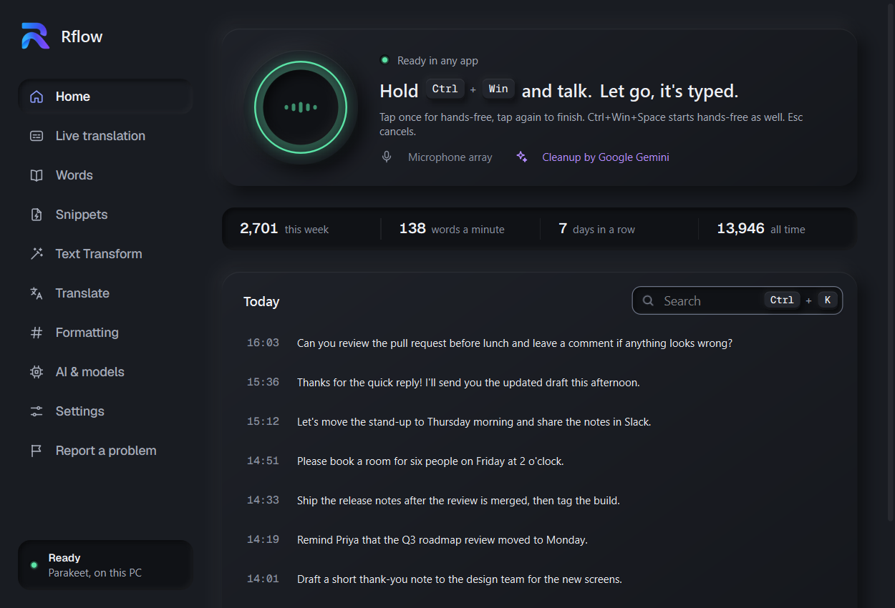
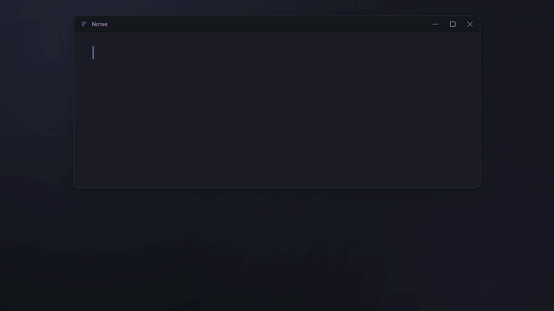
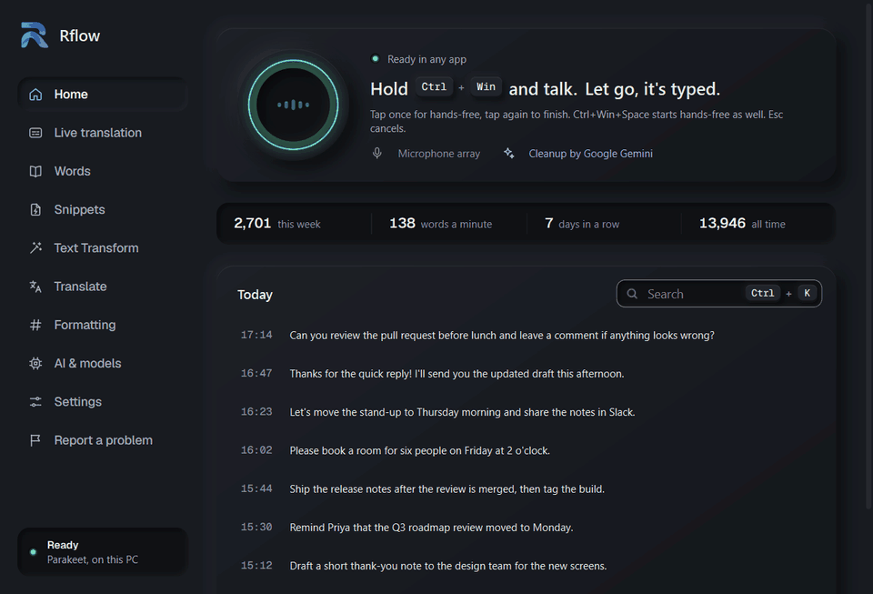
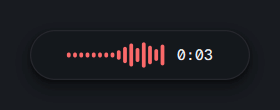
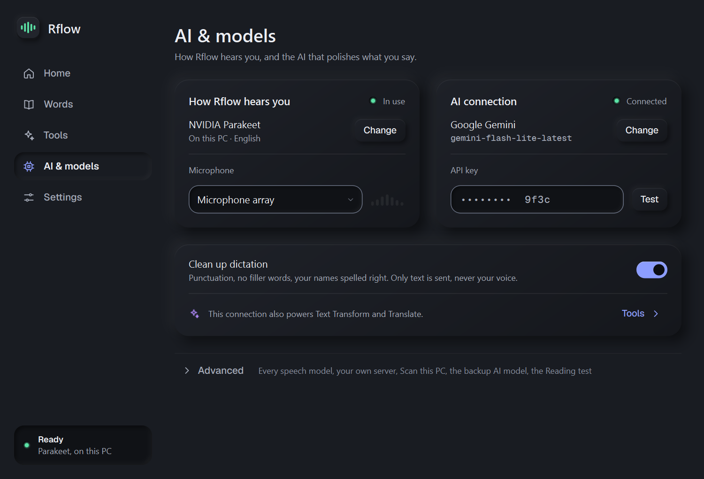
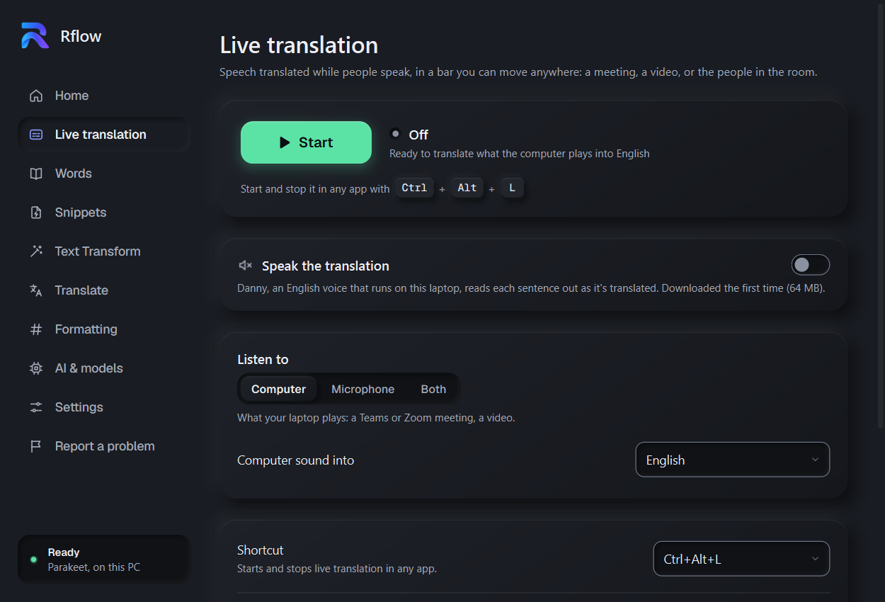
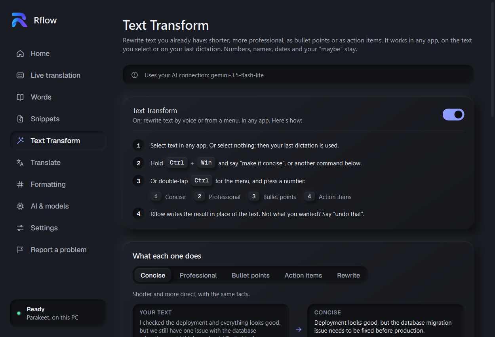
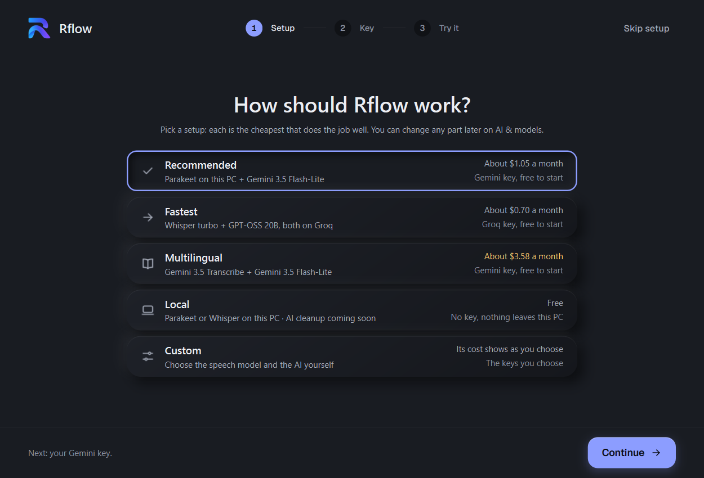
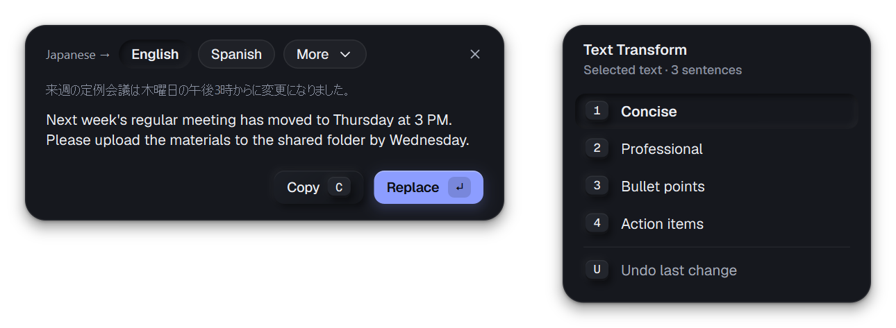
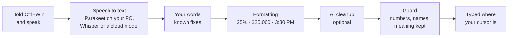

<div align="center">


# rflow-ai

### **Rflow** · speak anywhere, it types

Free, open-source dictation for Windows. Hold <kbd>Ctrl</kbd> + <kbd>Win</kbd> in any app, speak, let go:<br>
your words are typed where your cursor is. Speech is recognised **on your laptop**.

[](https://github.com/karthi-ai-engineer/rflow-ai/releases/latest)
[](https://github.com/karthi-ai-engineer/rflow-ai/releases)
[](https://github.com/karthi-ai-engineer/rflow-ai/actions/workflows/ci.yml)
[](LICENSE)
[](#-quick-start)

[](https://github.com/karthi-ai-engineer/rflow-ai/releases/latest/download/Rflow-Setup.exe)
[](https://rflow-ai.vercel.app)

<picture>
  <source media="(prefers-color-scheme: light)" srcset="site/img/app-light.png">
  
</picture>

</div>

<br>

<table>
<tr>
<td width="33%" valign="top">

### 🔒 Private by default
NVIDIA Parakeet turns speech into text **on your own PC**. With it, your voice never leaves the laptop. No account, no telemetry.

</td>
<td width="33%" valign="top">

### ⚡ Fast, everywhere
Works in every app: Teams, Slack, Outlook, Word, VS Code, the browser. A 7-second sentence is typed about **a second** after you let go.

</td>
<td width="33%" valign="top">

### 💸 Free, and honest about costs
Rflow is free. Cloud models use **your own key**, and every model shows what it costs a month **before** you pick it.

</td>
</tr>
</table>

## 🎬 See it in action

<div align="center">

<br><br>

<br><br>

<br>
<sub>While you speak, a small pill shows your voice, then "Typed". It never takes the keyboard from your app.</sub>
</div>

## ✨ What it does

| | Feature | What you get |
|:-:|---|---|
| 🎙️ | **Dictation anywhere** | Hold <kbd>Ctrl</kbd>+<kbd>Win</kbd> and talk, or tap it to go hands-free. Your clipboard is left as it was. |
| 🧠 | **Speech on your PC, or in the cloud** | NVIDIA Parakeet (English, fast, offline), Whisper large-v3 turbo (99 languages), OpenAI, Groq or Gemini with your key, or your own server. |
| 🧭 | **Ready-made setups** | Recommended, Fastest, Multilingual or Local: each picks the cheapest model that does the job well. |
| 🌐 | **Live translation** | A meeting, a video or the people in the room, translated while they speak, in a bar you can move anywhere, however low the sound is turned. A voice can speak it too, with the original lowered like an interpreter's. |
| ✍️ | **Text Transform** | Say *"make it concise"*, *"professional"*, *"bullet points"* or *"action items"*, or double-tap <kbd>Ctrl</kbd> for a menu. |
| 🔤 | **Translate** | Select text in any app, press <kbd>Ctrl</kbd>+<kbd>C</kbd> twice: the translation appears at the pointer. |
| 📚 | **Your words and snippets** | Names spelled your way, sound-alikes fixed (*"post grass"* → PostgreSQL), and *"my email"* typing your email. |
| 🔢 | **Formatting** | *"twenty five percent"* → 25%, money as $25,000, times as 3:30 PM, dates and email addresses. |
| ✨ | **AI cleanup (optional)** | Punctuation and no "um"s, by OpenAI, Anthropic, Gemini, Groq, Ollama or vLLM. Only text is sent, never audio. |
| 🛡️ | **Never loses your words** | A guard keeps numbers, names and meaning; if anything fails, the text is still typed or kept on Home. |

## 🖼️ A look inside

<table>
<tr>
<td width="50%" valign="top">
<br>
<b>Setups and costs.</b> Pick a setup and see what it costs a month. All your API keys live in one place.
</td>
<td width="50%" valign="top">
<br>
<b>Live translation.</b> One big Start; while it runs, a red Stop and a blinking light. The voice can read it out.
</td>
</tr>
<tr>
<td width="50%" valign="top">
<br>
<b>Text Transform.</b> How to use it in three steps, and what each mode does, with before-and-after examples.
</td>
<td width="50%" valign="top">
<br>
<b>A first run that decides for you.</b> Choose a setup, paste one key (or none), try your first dictation.
</td>
</tr>
</table>

<div align="center">
<br>
<sub>Translate (<kbd>Ctrl</kbd>+<kbd>C</kbd><kbd>C</kbd>) and Text Transform's menu (double-tap <kbd>Ctrl</kbd>) float over any app and never take its focus.</sub>
</div>

## 🚀 Quick start

1. **[Download `Rflow-Setup.exe`](https://github.com/karthi-ai-engineer/rflow-ai/releases/latest/download/Rflow-Setup.exe)** (about 90 MB) and run it. No administrator rights, no Python. Windows 10 or 11, 64-bit; ARM laptops (Snapdragon) run it through Windows 11's emulation.
2. **Pick a setup.** *Recommended* hears you on this PC (a one-time 663 MB download, then offline) and polishes the text with a low-cost AI.
3. **Click in any text box, hold <kbd>Ctrl</kbd>+<kbd>Win</kbd> and speak.** Let go, and your words appear.

> [!NOTE]
> Windows may say *"Windows protected your PC"* because the installer isn't code-signed yet. Click **More info → Run anyway**. Rflow updates itself: when a new version is out, a banner offers it, and the download is checked against its published checksum before it's installed.

### ⌨️ Keys

| Keys | What happens |
|---|---|
| hold <kbd>Ctrl</kbd>+<kbd>Win</kbd> | talk while holding; let go to type |
| tap <kbd>Ctrl</kbd>+<kbd>Win</kbd>, speak, tap again | hands-free |
| <kbd>Ctrl</kbd>+<kbd>Win</kbd>+<kbd>Space</kbd> | hands-free as well |
| <kbd>Esc</kbd> while recording | cancel: nothing is typed |
| <kbd>Ctrl</kbd>+<kbd>C</kbd> twice | translate the selected text |
| double-tap <kbd>Ctrl</kbd> | Text Transform's menu (<kbd>1</kbd>–<kbd>4</kbd>, <kbd>U</kbd> to undo) |
| <kbd>Ctrl</kbd>+<kbd>Alt</kbd>+<kbd>L</kbd> | start or stop live translation |
| <kbd>Ctrl</kbd>+<kbd>K</kbd> | search your dictations in Rflow |

### 🧭 Setups and what they cost

| Setup | Speech | AI cleanup | Key | About a month* |
|---|---|---|---|---|
| ⭐ **Recommended** | Parakeet, on your PC | Gemini 3.5 Flash-Lite | Gemini (free to start) | **$1.05** |
| ⚡ **Fastest** | Whisper large-v3 turbo, on Groq | GPT-OSS 20B, on Groq | Groq (free to start) | **$0.70** |
| 🌍 **Multilingual** | Gemini 3.5 Transcribe | Gemini 3.5 Flash-Lite | Gemini | **$3.58** |
| 💻 **Local** | Parakeet or Whisper, on your PC | AI on your PC: coming soon | none | **free** |
| 🎛️ **Custom** | any model | any model | yours | shown as you choose |

<sub>* For typical use, 20 minutes of dictation a day, paid to the provider with your own key, at the providers' prices of October 2026. Free keys cost nothing within their limits; Google may use free-tier text to improve its models. Expensive models are marked in red before you choose them.</sub>

## 🔐 What leaves your PC

| Feature | What is sent | To whom |
|---|---|---|
| Dictation with Parakeet or Whisper | **nothing** | — |
| Dictation with a cloud model | the recording | the provider you chose, with your key |
| AI cleanup (optional) | the finished text, never audio | the provider you chose |
| Text Transform and Translate | the text you select | the provider you chose |
| Live translation | what it listens to (the computer's sound, the microphone, or both) | Google Gemini, with your key, after it asks |
| Updates | a version check | GitHub |

Your API keys are encrypted for your Windows account (DPAPI). Settings, words, history and recordings stay in `%APPDATA%\sst` and `%LOCALAPPDATA%\sst`; **Settings → Start over** deletes them all.

## ⚙️ How it works



Long dictations are cut at your pauses and transcribed **while you speak**, so the text is ready moments after you stop. Live translation is a pipeline of its own (`sst/live/`) and never shares dictation's code.

## 📖 The full guide

<details>
<summary><b>The window's ten sections</b></summary>
<br>

| Section | What it's for |
|---|---|
| **Home** | the voice orb and how to dictate, a stats strip (this week, words per minute, days in a row, all time), and your dictations by day, searchable with **Ctrl+K**, with Correct and Copy under the pointer |
| **Live translation** | a big green **Start**; while it runs, a red **Stop**, a blinking "Live" light and what it's translating into what. **Speak the translation**: an English voice on the laptop (Piper's Danny, 64 MB, downloaded once) reads each sentence out, and like an interpreter Rflow lowers the other apps while it speaks (a slider says how much; they come back after each sentence). It keeps translating however low the sound is turned. Listen to the **Computer** (a meeting, a video), the **Microphone** (the room) or **Both** (an online meeting: your words marked "You"). The bar stays out of screen shares unless you let colleagues read it; each session's transcript is listed. Google Gemini 3.5 Live Translate with your Gemini key (about $2.20 an hour per source) |
| **Words** | *Your words*: names, products and terms that speech recognition listens for and the AI cleanup spells your way; sound-alikes and corrections you made twice, to learn |
| **Snippets** | say a short phrase, get your own text (**"my email"** types your email address), typed exactly as written and never sent to the AI |
| **Text Transform** | rewrite text you already have: hold Ctrl+Win and say **"make it concise"**, "make it professional", "bullet points" or "action items" (your own phrases too), or **double-tap Ctrl** for a menu. It works on the selected text in any app, or else your last dictation, checked so no number, name, date, "not" or "maybe" is lost or invented |
| **Translate** | select text and press **Ctrl+C twice**: a window at the pointer shows it translated; **C** copies it, **Enter** replaces the text |
| **Formatting** | **Write numbers as numbers**, with real examples of what changes and what stays as you said it |
| **AI & models** | the **setups**, **Your API keys** (adding a key never changes what the AI cleanup uses), how Rflow hears you (**On this PC**: Parakeet, Whisper, Scan this PC; **Cloud**: OpenAI, Groq, Gemini, or your own server), the AI connection with a backup model, and the microphone with a live meter |
| **Settings** | the dictation key, sounds, starting with Windows, keeping recordings, keeping the microphone ready, updates, the Reading test. **Advanced**: the voice pipeline, troubleshooting steps, Windows' voice effects, Profiles, logs, source code. **Start over** deletes everything and restarts Rflow like a new install |
| **Report a problem** | a bug report on GitHub, the version information to copy (no dictated text), and the logs folder |

</details>

<details>
<summary><b>AI cleanup: providers and models</b></summary>
<br>

| Provider | What to enter |
|---|---|
| OpenAI, Anthropic, Google Gemini, Groq | an **API key** ("Get a key" opens the provider's page) |
| Ollama (on this computer) | nothing: it uses `http://localhost:11434/v1` |
| vLLM or another OpenAI-compatible server | its **address** (e.g. `http://localhost:8000/v1`, LM Studio, a company AI gateway) and a key if it needs one |

Fast, cheap models suit dictation (claude-haiku-4-5, gemini-3.5-flash-lite, openai/gpt-oss-20b on Groq, gpt-4o-mini). Models that "think" first are asked to think as little as they allow; the big ones (Pro, Opus, the largest GPT) are slow and costly for dictation, and Rflow marks them. Each provider gets the request it understands (`sst/modelrules.py`). If the model fails or its answer is cut off, the backup model is used; if the provider is slow or unreachable, the text is typed as heard and the pill says so. Home keeps both versions.

Add **your words** (names, company, products, tech terms) so they come out spelled right: speech recognition listens for them too, even with cleanup off. On the owner's reading test, errors on names and terms fell from 40% to 24.5%.

</details>

<details>
<summary><b>Profiles</b></summary>
<br>

Several people on one computer, or a work and a private setup, each get a profile (the button under the logo). Each has its own dictation key, microphone, words, AI provider and keys, dictations, stats and reading tests. The first profile keeps its files in `%APPDATA%\sst`, the others in `%APPDATA%\sst\profiles\<name>`.

</details>

<details>
<summary><b>Reading test: measure accuracy on your own voice</b></summary>
<br>

Five sets of 30 short sentences measure how well Rflow understands *your* voice, microphone and words (about 6 minutes a set). Sets A and B are practice (the words Rflow suggests come from them); C to E are the real test. Rflow shows the share of words it got wrong with speech recognition alone and with your cleanup models, with a 95% range and whether a setup is really better or just lucky; errors on names and terms; the time per sentence; and warnings when a microphone sounds like a phone call, clips or is very quiet. `rflow-cli eval` scores every test from the command line (`--model`, `--no-cleanup`, `--words`, `--degrade narrowband`). See [docs/accuracy.md](docs/accuracy.md).

</details>

<details>
<summary><b>Troubleshooting</b></summary>
<br>

- **Nothing typed in one particular app?** It probably runs as administrator; Windows doesn't let normal programs type into those.
- **Using Wispr Flow too?** Quit it first: it also listens to Ctrl+Win, and both would type. Rflow warns you if it's running.
- **Windows' own Ctrl+Win shortcuts** (Ctrl+Win+D, Ctrl+Win+←/→) still work; they simply drop the recording.
- **The microphone icon stays on** for 5 minutes after a dictation, so the next one starts at once; change it in Settings ("Microphone stays ready"). Nothing is recorded or sent until you press the key.
- **Where things are:** settings and history in `%APPDATA%\sst`, recordings in `%LOCALAPPDATA%\sst\recordings`, logs in `%LOCALAPPDATA%\sst\logs` (they can hold dictated text: check before sharing them). `rflow-cli.exe` next to `Rflow.exe` is the command-line tool.

</details>

## 🛠️ Build from source

Needs Windows 10/11 (x64 Python, also on ARM laptops) and [uv](https://docs.astral.sh/uv/).

```bash
git clone https://github.com/karthi-ai-engineer/rflow-ai.git
cd rflow-ai
uv sync                                          # the app and the dev tools
uv run python scripts/download_model.py parakeet # the speech model (~630 MB) into models/
uv run sst app                                   # the tray app (quit an installed Rflow first)
uv run pytest                                    # tests: fakes only, no keys pressed, no network
uv run ruff check .                              # lint
```

<details>
<summary><b>Installer, releases and the website</b></summary>
<br>

**Build the installer** with `build_installer.cmd` (needs the model in `models/` and [Inno Setup 6](https://jrsoftware.org/isinfo.php)). It builds `Rflow.exe` and `rflow-cli.exe` with PyInstaller, checks with the model that they really transcribe and open their windows, then takes the model out again and writes `dist\Rflow-Setup-<version>.exe`.

**Release:** raise `__version__` in `sst/__init__.py` in the pull request, merge it, tag `main` with `vX.Y.Z`. The Release workflow publishes `Rflow-Setup.exe` and `Rflow-Setup.exe.sha256`; the website's download button and every installed Rflow see it right away.

**Website:** `site/` is a static page on Vercel. Its screenshots are drawn from the real window by `scripts/make_site_screenshots.py`; this README's animations by `uv run --with pillow python scripts/make_readme_media.py`.

Work happens phase by phase: an issue, a branch and a pull request into `main`, checked by CI (tests and app builds on x64 and Windows on ARM, lint, CodeQL). [`CLAUDE.md`](CLAUDE.md) has the working rules and [`HANDOFF.md`](HANDOFF.md) says where things stand.

</details>

<details>
<summary><b>Project layout</b></summary>
<br>

```
rflow-ai/
├─ site/                      the download website (Vercel): index.html, screenshots, icon
├─ docs/                      accuracy plan and research, the design, the README's animations (media/)
├─ scripts/                   models, installer build, logo, screenshots and README media
├─ packaging/                 installer recipe: entry points, sst.spec, installer.iss, notices, images
├─ tests/                     pytest suite
└─ sst/                       the Python package (the app's internal name)
   ├─ app.py                  the app: tray icon, recording pill, dictation, updates, Start over (Qt)
   ├─ window.py               the window's ten sections and the first run; light/dark
   ├─ theme.py, ui.py         the look (Obsidian Signal) and its widgets
   ├─ setups.py, costs.py     the ready-made setups, and what each model costs a month
   ├─ gateway.py              AI cleanup: providers, request formats, backup model, keys (DPAPI)
   ├─ modelrules.py           what each provider's models accept (temperature, thinking)
   ├─ dictate.py, pipeline/   dictation: record → transcribe → your words → formatting → cleanup → guard → type
   ├─ hotkey.py, paste.py     global hotkeys, and pasting where the cursor is
   ├─ commands.py, transform*.py, textaccess.py   Text Transform
   ├─ translate*.py, snippets.py                  Translate and Snippets
   ├─ live/                   live translation, a pipeline of its own (WASAPI, Gemini, the bar, the voice)
   ├─ engines/                speech models: Parakeet, Whisper, the cloud, your own server
   ├─ bench.py, evaluate.py   the reading test and `sst eval`
   ├─ settings.py, updates.py profiles and settings, in-app updates
   └─ static/                 icon, logo, fonts, the window's images
```

</details>

<details>
<summary><b>Adding another speech engine</b></summary>
<br>

Speech recognition is a building block: any engine works with any AI cleanup model. Create `sst/engines/<name>.py` with a class that has `name`, `title`, `signature` (what its text depends on; `sst eval` caches by it), an optional `words` list and `transcribe(audio, sample_rate) -> str`. Add it to `SPEECH_MODELS` and `load_engine()` in `sst/engines/__init__.py`. It shows up on AI & models, the app loads it in the background when chosen, and `sst eval --engine <name>` uses it.

</details>

## 🗺️ What's next

- [ ] Privacy controls: recordings kept 30 days, delete one or all, transcripts with an on/off switch
- [ ] A smoother first run and shortcuts that wait until their feature is set up
- [ ] Layout, keyboard access and speed fixes
- [ ] A code-signed installer and update controls
- [ ] Moving to a new PC: export and import your setup
- [ ] An AI model on your PC, for a setup where nothing leaves it

Ideas and votes are welcome in [Discussions](https://github.com/karthi-ai-engineer/rflow-ai/discussions).

## 🤝 Contributing

Bug reports, feature requests and pull requests are welcome: [CONTRIBUTING.md](CONTRIBUTING.md) says how to set up, what the tests must never do, and how a pull request is reviewed. Security flaws are reported privately ([SECURITY.md](SECURITY.md)). Everyone follows the [code of conduct](CODE_OF_CONDUCT.md).

## 🙏 Built on

[NVIDIA Parakeet](https://huggingface.co/nvidia) · [OpenAI Whisper](https://github.com/openai/whisper) · [sherpa-onnx](https://github.com/k2-fsa/sherpa-onnx) · [faster-whisper](https://github.com/SYSTRAN/faster-whisper) · [Piper voices](https://huggingface.co/rhasspy/piper-voices) · [Qt for Python](https://doc.qt.io/qtforpython-6/) · [Geist](https://github.com/vercel/geist-font). Their licenses are in [packaging/NOTICES.txt](packaging/NOTICES.txt).

## 📄 License

Rflow is released under the [MIT License](LICENSE). The files it builds on keep their own licenses, listed in [packaging/NOTICES.txt](packaging/NOTICES.txt): NVIDIA Parakeet's tokenizer vocabulary (NVIDIA Open Model License), the Geist fonts (SIL Open Font License), the sample sentence (CC BY 4.0), and the models and voice Rflow downloads when you choose them. The Rflow name and logo are not covered by the MIT License: a fork is welcome, under its own name.

<div align="center">
<br>

Made by **[karthi-ai-engineer](https://github.com/karthi-ai-engineer)**, AI Application Engineer @ Tokyo, Japan

<sub>If Rflow saves you some typing, a ⭐ helps others find it.</sub>

</div>
